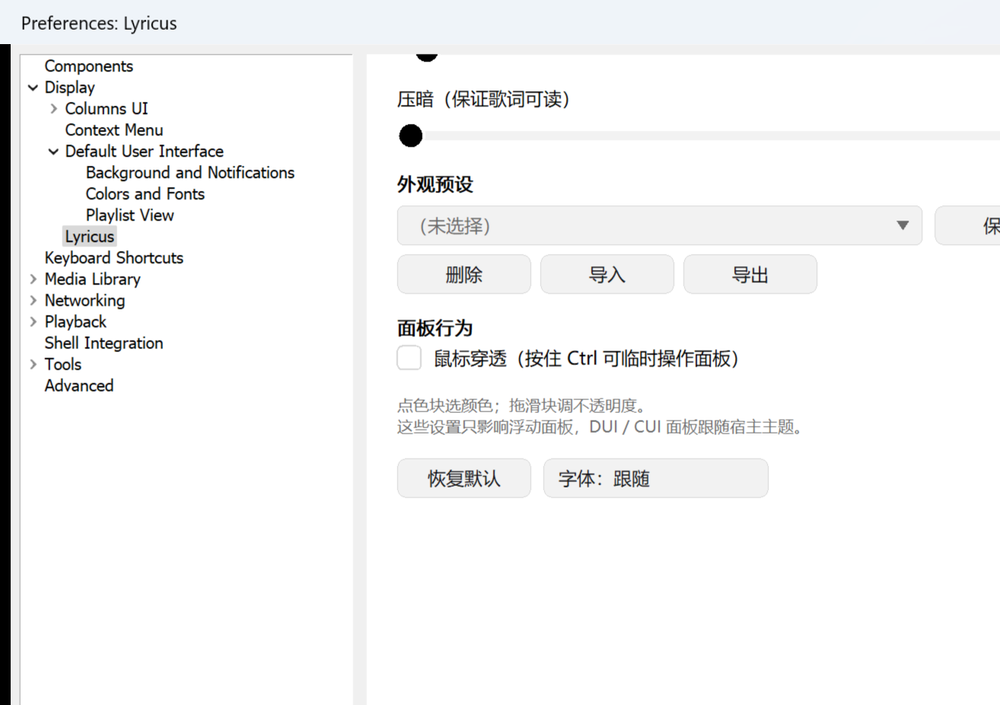

# Lyricus

**foobar2000 的歌词面板**。一个独立置顶的半透明窗口，显示当前曲目的歌词，底下带一条播放控制条。

不是"另一个歌词显示组件"：它把歌词显示和播放控制放在同一个窗口里，
所以副屏上可以只留它一个；关掉主窗口它照样工作。


## 功能

**歌词**

- 本地 `.lrc` 搜索（文件名匹配加模糊评分），支持 UTF-8、UTF-16、GB18030 编码识别
- 三个在线源：网易云、酷狗、LRCLIB。顺序和启用状态由你定，菜单里能上移下移
- 双语歌词（译文合并成同一时间戳的第二行）
- 长行横滚、换行上滑过渡、放不下时省略号截断
- 无标签曲目可以按文件夹指定搜索线索（歌手、专辑）

**面板**

- 全自绘。颜色、字体、不透明度、控件配色都能改，也可以存成外观预设导入导出
- 背景图（磨砂、压暗、6 种适配方式），带一个所见即所得的预览框，
  可直接拖动构图、拖四角缩放
- 鼠标穿透开关：开了之后点击落到下面的窗口上，按住 `Ctrl` 可以临时操作面板
- 三种宿主：独立浮动面板、DUI 元素、Columns UI 面板

**控制条**

- 播放与暂停、上下曲、可拖拽进度条、时间、音量条、静音、滚轮调音量
- 面板窄到放不下时按顺序降级（按钮、进度条、时间、音量条），而不是挤成一团

## 安装

1. 从 Releases 页下载 `foo_lyricus.fb2k-component`
2. 打开 foobar2000 的首选项，进 Components 页，点 Install，选那个文件
3. 重启 foobar2000

需要 **foobar2000 2.x x64**。

打开面板在 View 菜单的 Lyricus 子菜单里。
外观和背景图在首选项的 Display 分类下。



## 构建

需要 Visual Studio（C++20）和 foobar2000 SDK。

```powershell
# 一次性：把 SDK、WTL 和依赖放到 3rdparty/ 下（体积大，不进版本库）
.\tools\setup.ps1

# 构建
.\build.ps1
```

产物在 `bin\` 下的 `foo_lyricus.dll`，打包用 `.\tools\package.ps1`。

热安装：`.\tools\watch-install.ps1` 会守着 `bin\`，改完自动装进组件目录。
默认不打断播放，等你下次关播放器才重启；要立刻重启用 `-Relaunch`。

依赖的获取方式见 [docs/setup.md](docs/setup.md)。

## 测试

891 项离线断言，不需要 foobar2000，也不需要联网。

```powershell
cd tests\harness
.\run.ps1              # 全跑
.\run.ps1 -Suite bg    # 只跑一组
```

分层的唯一依据就是能不能进这个单测台。不碰 SDK 头的纯逻辑全都在里面：
LRC 解析、搜索评分、在线 JSON、排版布局、颜色换算、背景图几何等等。
UI 和线程编排进不去，靠 `tools\capture-ui.ps1` 抓真机截图再看。

## 项目结构

```
src/           组件源码（61 个文件）
  lyric*         LRC 解析、搜索、在线源
  lyrics_view*   歌词排版与绘制（三种宿主共用）
  control_window 独立浮动面板（分层窗口）
  dui_element    DUI 元素
  cui_panel      Columns UI 面板
  prefs_*        首选项页（全自绘）
  bg_*           背景图几何与解码
  color_*, ui_draw, dpi_util   公共小工具
tests/harness  离线单测台（自带极简断言框架）
tools/         构建、打包、热安装、截图脚本
docs/          决策记录、路线图、开发计划
```

## 文档

| 文件 | 回答 |
|---|---|
| [docs/roadmap.md](docs/roadmap.md) | 现在在哪、东西在哪、这个奇怪的现象是不是有意的 |
| [docs/decisions.md](docs/decisions.md) | 为什么这么做（129 条决策，倒序） |
| [docs/plan.md](docs/plan.md) | 还要做什么 |
| [docs/design-lyric-motion.md](docs/design-lyric-motion.md) | 横滚、上滑、遮罩的设计 |

遇到"这是什么"或"是不是 bug"时，先查 `roadmap.md` 第三章的症状速查表，
而不是读代码。读代码能告诉你做了什么，告诉不了你这是不是故意的：
一个刻意的设计和一个 bug，在代码里长得一模一样。

## 许可

[MIT](LICENSE)。foobar2000 SDK 与 WTL 有各自的许可，本项目只覆盖自己的代码。
